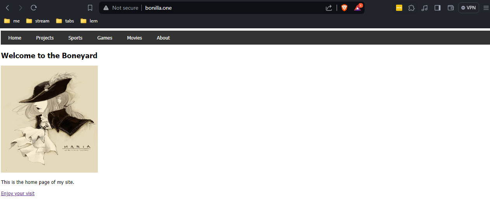

## Building My Own Website
Sometime ago, I purchased the `bonilla.one` domain from Google Domains. I never did anything with it, but I figured I'd lock it down for the wonderful price of $12/year (I think.) Fast forward to now, I'd like to do some "full-stack" development to better understand the workflows and technologies that my co-workers use. It is my hope that I'll gain much more experience and knowledge surrounding a more developer-heavy experience, as opposed to that of a DevOps/Platform engineer. 

### Build a "website"
Basically just need some HTML files to get going. The end goal is to have a generic blog with some funny stuff on it, but also include a form that allows users to submit a movie or song review that will then be sent to a backend thing to do a thing with the thing. See the `website.html` file.

* HTML files can be easily tested locally.
* Added some CSS for a menu bar.

### Get yourself a server
We're going to be hosting this website using Nginx on AWS. 

1. Create an EC2 instance.
2. Create an elastic IP address and associate it with your EC2 instance. 
3. Edit the instance's security group to allow all inbound traffic on port 80.

* This should be done with Terraform, but we'll take care of that later on. 

### Configure DNS
Go to Google Domains. Add a custom DNS A record for your site name. I chose to use `app.bonilla.one` and linked that to my allocated IPv4 address from my AWS elastic IP from earlier. I also created a CNAME record for `www.bonilla.one` which points to `app.bonilla.one`

### Install and configure Nginx
Now we can SSH into our web server using our custom domain name. Once we're connected to our server via SSH, we need to install and enable nginx. 
`apt install nginx`
`systemctl enable nginx`
To configure Nginx, we need to modify the configuration file located at `/etc/nginx/nginx.conf`. For now, lets simply modify the `server_name` and `index` values in the server stanza. This will link our Nginx web server to our domain name and serve the `website.html` HTML file as the homepage.
```
# Snippet of Nginx configuration from nginx.conf
server {
    listen          80;
    server_name     my_website.com www.my_website.com;
    root            /usr/share/nginx/html;
    index           website.html

    ...
}
```
### Visit the site
Now we can navigate to our site and if we've followed the steps correctly, our web browser should render our `website.HTML` file when we navigate to `www.my_website.com`.



